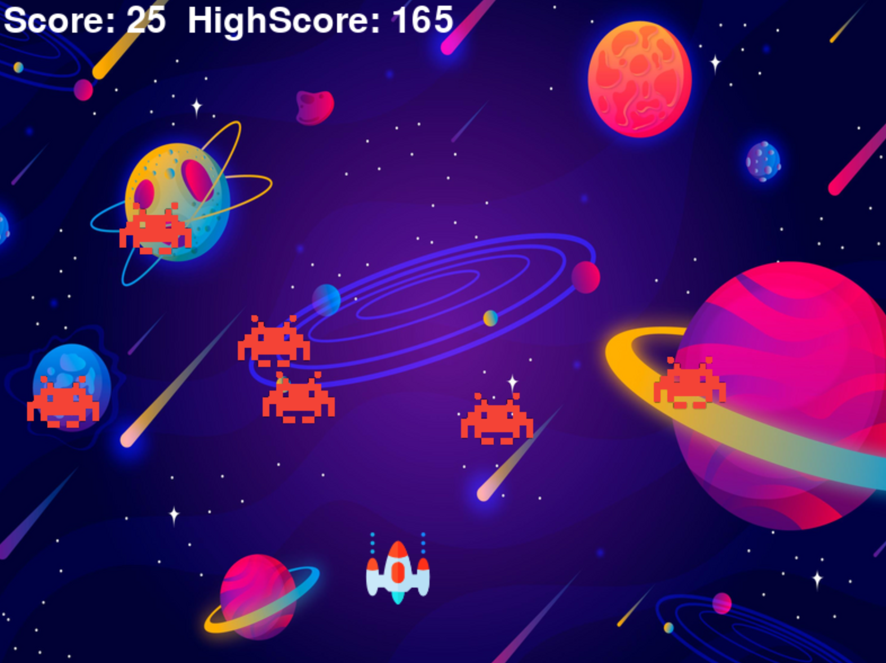

# Alien Assault Game

Alien Assault is a classic arcade-style shooting game built with Python and the Pygame library. In this game, you control a spaceship and your mission is to shoot down waves of incoming alien invaders while avoiding their attacks. The game features different difficulty modes, high score tracking, and exciting sound effects.

## Table of Contents

- [Getting Started](#getting-started)
- [Game Controls](#game-controls)
- [Gameplay](#gameplay)
- [Features](#features)
- [High Score](#high-score)
- [Screenshots](#screenshots)
- [Contributing](#contributing)
- [License](#license)

## Getting Started

To play Space Invaders on your local machine, follow these steps:

1. Clone the repository to your computer.
2. Install Python if you don't have it installed already.
3. Install the Pygame library by running `pip install pygame`.
4. Run the game by executing `python main.py`.

## Game Controls

- Use the **left and right arrow keys** to move your spaceship.
- Press the **spacebar** to fire bullets at the alien invaders.
- In the main menu, press **1** for easy mode or **2** for hard mode.

## Gameplay

- Your goal is to shoot down as many alien invaders as possible.
- Avoid getting hit by enemy projectiles.
- Each alien shot down earns you one point.
- The game ends when an alien invader reaches the bottom of the screen or when your spaceship gets hit.

## Features

- Two game modes: Easy and Hard.
- Progressive difficulty as your score increases.
- High score tracking.
- Exciting sound effects and background music.
- Simple and intuitive controls.
- Engaging gameplay inspired by the classic Space Invaders arcade game.

## High Score

The game keeps track of your highest score. If you beat your previous high score, it will be updated automatically. You can also check the high score in the main menu.

## Screenshots

## Contributing

Contributions are welcome! If you have any ideas for improving the game or find any issues, please open an issue or create a pull request. We appreciate your contributions.

## License

This project is licensed under the MIT License - see the [LICENSE](LICENSE) file for details.
